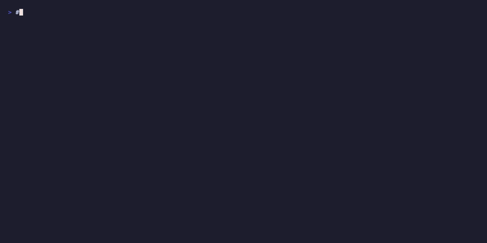

<p align="center">
  
</p>

<p align="center">
  <a href="https://github.com/northcutted/dock-docs/actions/workflows/test.yml"></a>
  <a href="https://github.com/northcutted/dock-docs"></a>
  <a href="https://github.com/northcutted/dock-docs/releases/latest"></a>
  <a href="https://github.com/northcutted/dock-docs/blob/main/LICENSE"></a>
  <a href="https://goreportcard.com/report/github.com/northcutted/dock-docs"></a>
  <a href="https://github.com/northcutted/dock-docs/stargazers"></a>
</p>

# Dock-Docs

**Like [terraform-docs](https://github.com/terraform-docs/terraform-docs), but for Dockerfiles.**

A CLI tool that automatically generates documentation from your Dockerfiles. It goes beyond static analysis by building your image and running deep inspections using industry-standard tools like [Syft](https://github.com/anchore/syft), [Grype](https://github.com/anchore/grype), and [Dive](https://github.com/wagoodman/dive). Output in Markdown, HTML, or JSON. Works with Docker and Podman.

- [Dock-Docs](#dock-docs)
  - [Quick Start](#quick-start)
  - [Features](#features)
  - [How It Works](#how-it-works)
  - [Installation](#installation)
    - [Go Install](#go-install)
    - [Pre-built Binaries](#pre-built-binaries)
    - [Docker / Podman](#docker--podman)
  - [Prerequisites](#prerequisites)
  - [Usage](#usage)
    - [CLI Mode](#cli-mode)
    - [YAML Mode](#yaml-mode)
    - [CLI Flags](#cli-flags)
  - [Magic Comments](#magic-comments)
    - [Examples](#examples)
  - [Configuration Reference (`dock-docs.yaml`)](#configuration-reference-dock-docsyaml)
    - [Structure](#structure)
    - [Markers](#markers)
    - [Section Types](#section-types)
      - [1. `image`](#1-image)
      - [2. `comparison`](#2-comparison)
  - [Templates](#templates)
    - [Built-in Templates](#built-in-templates)
    - [Output Format Behavior](#output-format-behavior)
    - [Using Templates](#using-templates)
    - [Custom Templates](#custom-templates)
    - [Template Developer Tools](#template-developer-tools)
    - [Security](#security)
  - [GitHub Action](#github-action)
  - [Samples](#samples)
  - [Demo](#demo)
  - [Troubleshooting](#troubleshooting)
  - [Credits](#credits)
  - [License](#license)
  - [AI Generated Content Disclaimer](#ai-generated-content-disclaimer)

## Quick Start

1. **Install dock-docs**:

   ```bash
   go install github.com/northcutted/dock-docs@latest
   ```

2. **Install analysis tools** (for image analysis):

   ```bash
   dock-docs setup
   ```

   This downloads `syft`, `grype`, and `dive` from their GitHub Releases into `~/.dock-docs/bin/`. See [Prerequisites](#prerequisites) for manual install alternatives.

3. **Run it**:

   ```bash
   # Analyze a Dockerfile and image
   dock-docs -f Dockerfile --image myapp:latest

   # Or use a config file for multi-section docs
   dock-docs --config dock-docs.yaml
   ```

That's it. The generated documentation is injected into your `README.md` between marker comments.

## Features

- **Automatic Documentation**: Parses standard Dockerfile instructions (`FROM`, `ENV`, `RUN`, `EXPOSE`, etc.) into clean tables.
- **Deep Analysis**:
  - **Syft**: Generates a Software Bill of Materials (SBOM) to list all installed packages.
  - **Grype**: Scans the image for known vulnerabilities.
  - **Dive**: Analyzes layer efficiency and wasted space.
- **Build & Inspect**: Automatically builds or pulls the container image to perform dynamic analysis.
- **Comparison Support**: Compare multiple images side-by-side (e.g., `python:3.12-slim` vs `python:3.14-slim`).
- **Multiple Output Formats**: 6 built-in templates producing Markdown, HTML, or JSON output.
- **Docker & Podman**: Auto-detects your container runtime. Works with Docker, Podman, and other Docker-compatible CLIs.
- **Enterprise Ready**: Support for private badge servers (e.g., self-hosted Shields.io).
- **Magic Comments**: Annotate your Dockerfile with `@description`, `@default`, and `@required` tags for richer docs.

## How It Works

Dock-docs operates in two phases:

1. **Static analysis** -- Parses your Dockerfile using the Moby BuildKit parser to extract `ARG`, `ENV`, `LABEL`, and `EXPOSE` instructions, along with any [magic comments](#magic-comments).

2. **Dynamic analysis** (optional) -- If an image tag is provided, dock-docs pulls or builds the image, then shells out to three external tools in parallel:
   - `syft` for SBOM / package listing
   - `grype` for vulnerability scanning
   - `dive` for layer efficiency analysis

The results are fed into a Go template and the rendered output is injected into your target file (e.g., `README.md`) between `<!-- BEGIN/END -->` marker comments. HTML and JSON templates write standalone files instead.

## Installation

### Go Install

```bash
go install github.com/northcutted/dock-docs@latest
```

### Pre-built Binaries

Download a pre-built binary from [GitHub Releases](https://github.com/northcutted/dock-docs/releases/latest):

```bash
# Linux (amd64)
curl -Lo dock-docs.tar.gz https://github.com/northcutted/dock-docs/releases/latest/download/dock-docs_Linux_x86_64.tar.gz
tar -xzf dock-docs.tar.gz dock-docs
sudo mv dock-docs /usr/local/bin/

# macOS (Apple Silicon)
curl -Lo dock-docs.tar.gz https://github.com/northcutted/dock-docs/releases/latest/download/dock-docs_Darwin_arm64.tar.gz
tar -xzf dock-docs.tar.gz dock-docs
sudo mv dock-docs /usr/local/bin/
```

### Docker / Podman

```bash
docker run --rm \
  -v $(pwd):/app -w /app \
  -v /var/run/docker.sock:/var/run/docker.sock \
  ghcr.io/northcutted/dock-docs:latest
```

> **Note:** The Docker socket mount (`-v /var/run/docker.sock:...`) is required for image analysis. Omit it if you only need Dockerfile parsing. For Podman, use `-v /run/podman/podman.sock:/var/run/docker.sock` or set `DOCKER_HOST` accordingly.

## Prerequisites

Dock-docs shells out to three external tools for image analysis. **These are only required if you want deep analysis** (vulnerability scanning, SBOM, layer efficiency). Dockerfile parsing works without them.

The easiest way to install them is:

```bash
dock-docs setup              # Install all missing tools to ~/.dock-docs/bin
dock-docs setup --check      # Show status only, don't install
dock-docs setup --force      # Reinstall even if present
dock-docs setup --dir /path  # Install to a custom directory
```

Alternatively, install them manually:

| Tool | Purpose | Install |
|------|---------|---------|
| [Syft](https://github.com/anchore/syft) | SBOM / package listing | `brew install syft` or [install script](https://github.com/anchore/syft#installation) |
| [Grype](https://github.com/anchore/grype) | Vulnerability scanning | `brew install grype` or [install script](https://github.com/anchore/grype#installation) |
| [Dive](https://github.com/wagoodman/dive) | Layer efficiency analysis | `brew install dive` or [GitHub Releases](https://github.com/wagoodman/dive/releases) |

System-installed tools (found in PATH) are always preferred over `dock-docs setup` installs. The `~/.dock-docs/bin/` directory is only checked as a fallback.

You also need a container runtime: **Docker** or **Podman**. Dock-docs auto-detects which one is available.

## Usage

### CLI Mode

If no `dock-docs.yaml` is found, the tool runs in **CLI Mode**. This is the simplest way to get started:

```bash
# Parse Dockerfile only (no image analysis)
dock-docs -f Dockerfile

# Parse Dockerfile and analyze a built image
dock-docs -f Dockerfile --image myapp:latest

# Output to a specific file
dock-docs -f Dockerfile --image myapp:latest -o DOCKER.md

# Preview output without writing to a file
dock-docs -f Dockerfile --dry-run
```

In CLI Mode, output is injected into `README.md` between the default markers:

```markdown
<!-- BEGIN: dock-docs -->
(generated content appears here)
<!-- END: dock-docs -->
```

### YAML Mode

Create a `dock-docs.yaml` to define multiple documentation sections, compare images, and use different templates per section:

```bash
# Auto-detects dock-docs.yaml in the current directory
dock-docs

# Or specify a config file
dock-docs --config my-config.yaml
```

See [Configuration Reference](#configuration-reference-dock-docsyaml) for the full YAML schema.

### CLI Flags

**General:**

| Flag | Short | Default | Description |
|------|-------|---------|-------------|
| `--config` | `-c` | `dock-docs.yaml` | Path to configuration file. Enables YAML Mode if found. |
| `--output` | `-o` | `README.md` | Output file path. |
| `--dry-run` | | `false` | Print output to stdout instead of modifying files. |
| `--nomoji` | | `false` | Disable emojis in the output. |
| `--ignore-errors` | | `false` | Ignore analysis errors and continue generation. |
| `--verbose` | | `false` | Enable verbose logging for debugging. |
| `--badge-base-url` | | `https://img.shields.io/static/v1` | Base URL for badge generation (for self-hosted Shields.io). |

**CLI Mode only:**

| Flag | Short | Default | Description |
|------|-------|---------|-------------|
| `--file` | `-f` | `./Dockerfile` | Path to the Dockerfile. |
| `--image` | | | Docker image tag to analyze (e.g., `myapp:latest`). |

**Template tools:**

| Flag | Description |
|------|-------------|
| `--template` | Template to use. Accepts a built-in name (`default`, `minimal`, `detailed`, `compact`, `html`, `json`) or a path to a custom `.tmpl` file. |
| `--list-templates` | List all available built-in templates with descriptions and exit. |
| `--export-template <name>` | Export a built-in template to stdout (e.g., `dock-docs --export-template default > my-template.tmpl`). |
| `--validate-template <path>` | Validate a custom template file for syntax errors and exit. |
| `--debug-template` | Print template resolution info (name, type, format) during rendering. |

## Magic Comments

You can enhance the generated documentation by adding special comments directly in your `Dockerfile`. These comments allow you to provide descriptions, default values, and requirement status for `ARG`, `ENV`, and `EXPOSE` instructions.

Supported tags:
- `@description:` A description of the variable or instruction.
- `@default:` The default value (overrides the value in the instruction).
- `@required:` (true/false) Whether the variable is mandatory.

### Examples

**Documenting an Environment Variable:**
```dockerfile
# @description: The API key for the service
# @required: true
ENV API_KEY=""
```

**Documenting a Build Argument:**
```dockerfile
# @description: The version of the base image
# @default: latest
ARG VERSION=latest
```

**Documenting an Exposed Port:**
```dockerfile
# @description: The main HTTP port
EXPOSE 8080
```

## Configuration Reference (`dock-docs.yaml`)

The `dock-docs.yaml` file allows you to define multiple sections of documentation that will be injected into your output file.

### Structure

```yaml
# The file where documentation will be injected (default: README.md)
output: "README.md"

# Base URL for badges (optional, defaults to https://img.shields.io/static/v1)
badgeBaseURL: "https://my-private-badges.com/static/v1"

# Global template configuration (optional, can be overridden per-section)
template:
  name: "detailed"       # Built-in template name
  # path: "./my-template.tmpl"  # Or path to a custom template file (overrides name)

# A list of documentation sections to generate
sections:
  - type: "image"       # Generates docs for a single Dockerfile
    marker: "main"      # Maps to <!-- BEGIN: dock-docs:main -->
    source: "Dockerfile" # Path to the Dockerfile
    tag: "myapp:latest"  # (Optional) Image to analyze for deep inspection

  - type: "comparison"  # Generates a comparison table for multiple images
    marker: "compare"   # Maps to <!-- BEGIN: dock-docs:compare -->
    source: "Dockerfile" # (Optional) Shared Dockerfile path for all images
    details: true        # (Optional) Include per-image analysis details (default: false)
    images:             # List of images to compare
      - tag: "myapp:dev"
      - tag: "myapp:prod"
      - tag: "alpine:latest"
        source: "Dockerfile.alpine"  # Override shared source for this image

  - type: "image"
    marker: "dashboard"
    source: "Dockerfile"
    tag: "myapp:latest"
    template:            # Per-section template override
      name: "html"       # Outputs a standalone HTML dashboard file
```

### Markers

To tell `dock-docs` where to insert the generated content, you must add **HTML comments** (markers) to your target file (e.g., `README.md`).

For a section with `marker: "main"`, add this to your `README`:

```markdown
<!-- BEGIN: dock-docs:main -->
<!-- END: dock-docs:main -->
```

Everything between these two lines will be overwritten by the tool.

### Section Types

#### 1. `image`
Parses a Dockerfile and optionally analyzes a built image.

- **`marker`** (Required): unique string to identify the injection point.
- **`source`** (Optional): Path to the `Dockerfile`. Defaults to `Dockerfile`.
- **`tag`** (Optional): If provided, the tool will pull/build and analyze this image using Syft, Grype, and Dive.
- **`template`** (Optional): Override the global template for this section. See [Templates](#templates).

#### 2. `comparison`
Generates a comparison table for multiple images, showing size, vulnerability counts, and efficiency scores.

- **`marker`** (Required): Unique string to identify the injection point.
- **`source`** (Optional): Shared Dockerfile path. Applies to all images unless overridden per-image.
- **`details`** (Optional): If `true`, include collapsible per-image analysis details. Defaults to `false`.
- **`images`** (Required): A list of image entries to analyze and compare. Each entry has:
  - **`tag`** (Required): The image tag to analyze.
  - **`source`** (Optional): Override the shared `source` for this image.
- **`template`** (Optional): Override the global template for this section. See [Templates](#templates).

## Templates

Dock-docs includes 6 built-in templates that control how documentation is rendered. Templates can produce Markdown, HTML, or JSON output.

### Built-in Templates

| Name | Format | Description |
|------|--------|-------------|
| `default` | Markdown | Standard format with badges and security analysis |
| `minimal` | Markdown | ENV/ARG only, no badges or analysis |
| `detailed` | Markdown | Expanded format with full package lists and metadata table |
| `compact` | Markdown | Single-line condensed format for quick reference |
| `html` | HTML | Interactive HTML dashboard with styled tables |
| `json` | JSON | Machine-readable JSON output for CI/CD integration |

All 6 templates support both **image** (single-image) and **comparison** (multi-image comparison) modes.

### Output Format Behavior

- **Markdown templates** (`default`, `minimal`, `detailed`, `compact`) inject content into an existing file (e.g., `README.md`) between `<!-- BEGIN/END -->` markers.
- **HTML template** writes a standalone `.html` file (e.g., `README.html`). In YAML mode with multiple sections, each HTML section writes to `{base}-{marker}.html`.
- **JSON template** writes a standalone `.json` file (e.g., `README.json`). Same multi-section naming as HTML.

### Using Templates

**Via CLI flag** (CLI Mode):
```bash
# Use a built-in template
dock-docs -f Dockerfile --template minimal

# Generate an HTML dashboard
dock-docs -f Dockerfile --template html

# Generate JSON output
dock-docs -f Dockerfile --template json --output results.json
```

**Via config file** (recommended):
```yaml
# Global template (applies to all sections)
template:
  name: "detailed"

sections:
  - type: "image"
    marker: "main"
    source: "Dockerfile"

  - type: "image"
    marker: "dashboard"
    source: "Dockerfile"
    template:
      name: "html"    # This section outputs HTML instead
```

### Custom Templates

You can create your own templates using Go's `text/template` syntax:

1. **Export a built-in template** as a starting point:
   ```bash
   dock-docs --export-template default > my-template.tmpl
   ```

2. **Edit the template** to customize the output format.

3. **Use your custom template**:
   ```bash
   # Via CLI
   dock-docs -f Dockerfile --template ./my-template.tmpl

   # Via config
   template:
     path: "./my-template.tmpl"
   ```

4. **Validate your template** for syntax errors:
   ```bash
   dock-docs --validate-template ./my-template.tmpl
   ```

### Template Developer Tools

| Flag | Description |
|------|-------------|
| `--list-templates` | List all built-in templates with descriptions |
| `--export-template <name>` | Export a built-in template to stdout |
| `--validate-template <path>` | Check a custom template for syntax errors |
| `--debug-template` | Print template resolution info during rendering |

### Security

Custom templates are subject to the following security controls:

- File paths must be relative (no directory traversal with `..`)
- Maximum template file size: 1 MB
- Execution timeout: 30 seconds
- Maximum output size: 10 MB

## GitHub Action

You can integrate dock-docs into your CI/CD pipeline using the GitHub Action:

```yaml
name: Generate Docker Docs
on:
  push:
    paths:
      - 'Dockerfile'
      - 'dock-docs.yaml'

jobs:
  docs:
    runs-on: ubuntu-latest
    steps:
      - uses: actions/checkout@v4

      - name: Generate Documentation
        uses: northcutted/dock-docs@main
        with:
          config: 'dock-docs.yaml'
          output: 'README.md'

      - name: Commit changes
        uses: stefanzweifel/git-auto-commit-action@v5
        with:
          commit_message: "docs: update docker documentation"
          file_pattern: "README.md *.html *.json"
```

The action automatically installs `syft`, `grype`, and `dive`. See [`action.yml`](action.yml) for the full list of inputs including `version`, `dry-run`, `nomoji`, `ignore-errors`, `verbose`, `file`, and `image`.

## Samples

Check out the sample projects to see `dock-docs` in action. Each sample includes a `dock-docs.yaml` with 12 sections showcasing all 6 built-in templates in both image and comparison modes.

- **[Go Sample](samples/go)** -- Analyzes `golang:1.26-alpine` and compares three Go image variants (`1.24-alpine`, `1.25-alpine`, `1.26-alpine`).
- **[Node.js Sample](samples/node)** -- Analyzes `node:24` and compares Alpine variants (`node:22-alpine`, `node:24-alpine`).
- **[Python Sample](samples/python)** -- Analyzes `python:3.14-slim` and compares three Python slim images (`3.12-slim`, `3.13-slim`, `3.14-slim`).

## Demo



*See dock-docs in action -- analyzing a Dockerfile and generating comprehensive documentation automatically.*

## Troubleshooting

**"syft: command not found" / "grype: command not found" / "dive: command not found"**

Run `dock-docs setup` to automatically download and install all three tools. Alternatively, install the [prerequisites](#prerequisites) manually. These tools are only required for image analysis -- Dockerfile parsing works without them. Use `--ignore-errors` to skip analysis failures.

**"Cannot connect to the Docker daemon"**

Ensure Docker or Podman is running. Dock-docs auto-detects the container runtime. 

For Podman on macOS, try running `export DOCKER_HOST="unix://$(podman machine inspect | yq ".[0].ConnectionInfo.PodmanSocket.Path")"` if dive has any issues. (`brew install yq` if needed`)

**"No markers found in file"**

Add marker comments to your output file. For a section with `marker: "main"`:
```markdown
<!-- BEGIN: dock-docs:main -->
<!-- END: dock-docs:main -->
```
In CLI mode (no config file), the default markers are `<!-- BEGIN: dock-docs -->` / `<!-- END: dock-docs -->`.

**The tool keeps using YAML mode but I want CLI mode**

If `dock-docs.yaml` exists in your working directory, the tool auto-detects it and switches to YAML mode. To force CLI mode, rename or remove the config file, or run from a directory without one.

**Image analysis shows unexpected sizes or architectures**

Image sizes and layer counts vary by platform. An `arm64` pull will produce different results than `amd64`. The analysis reflects the image for your current architecture.

## Credits

This tool relies on the following open-source projects for deep analysis:

- [Syft](https://github.com/anchore/syft) by Anchore (SBOM generation)
- [Grype](https://github.com/anchore/grype) by Anchore (Vulnerability scanning)
- [Dive](https://github.com/wagoodman/dive) by Alex Goodman (Layer efficiency analysis)

## License

[MIT License](LICENSE) -- Copyright (c) 2026 northcutted.

## AI Generated Content Disclaimer

Much of the code in this repository was generated using OpenCode `1.2.6` using the Github Copilot provider using `gemini-3-pro-preview` and `claude-sonnet-4.5` as a way to experiment with these tools and to attempt to solve a problem that I had. 

While the use of this tool requires no AI services to function, it was built using them so if tools heavily developed by AI agents is something you would like to avoid, then this tool is not for you.
